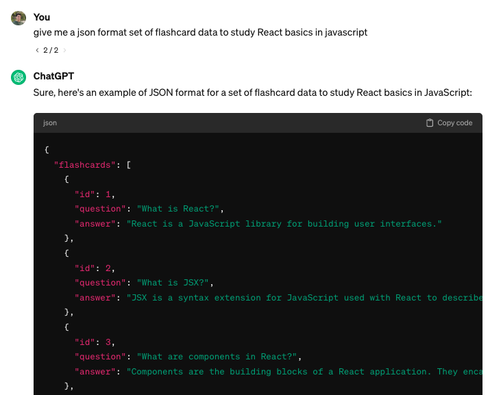

# React + Vite Flashcard App

## Brainstorming

I want to build a flashcard app. 

### MVP
I'm imagining a dataset of questions/answers and I can display each question as a "card". When I click on the card, it will "flip" and show me the answer.

### Stretch features

* Users can keep score
* There is a form so that users can add new flashcards
* Users can make "playlists" or "quizzes" that show a specific set of flashcards

## Setup

First, create the app using Vite: `npm create vite@latest` (you may be prompted to install the latest version of vite)

Then, empty out the starter code from `App.jsx`.

## Data

I know that I'll need some flashcard data to render.

To get myself started, I used ChatGPT to give me a dataset of flashcards rather than come up with my own set of questions. I asked for the data in JSON format so that I could easily import it into my app. I was also thinking down the line that it could be useful to use the dataset with [JSON Server](https://www.npmjs.com/package/json-server) if I wanted to emulate a full-stack app.



I then stored the resulting data in a `.json` file called `db/flashcards.json` (I made a `db` folder since this is sort of like my "database").

```json
{
  "flashcards": [
    {
      "id": 1,
      "question": "What is React?",
      "answer": "React is a JavaScript library for building user interfaces."
    },
    {
      "id": 2,
      "question": "What is JSX?",
      "answer": "JSX is a syntax extension for JavaScript used with React to describe what the UI should look like."
    },
    {
      "id": 3,
      "question": "What are components in React?",
      "answer": "Components are the building blocks of a React application. They encapsulate logic and UI."
    },
    ...
  ]
}
```

ChatGPT did a great job of giving me data in a format that I could easily use. 
* The data was in an Array which means I can render a "card" for each object using `.map()` in a `ul`
* Each flashcard object had:
  * an `id` which I can use for list item `key` props and much more
  * a `question` and an `answer` which will be useful for when I want to toggle which text I show to the user.

At this point I'm starting to think about my component structure.

## Component Structure

To make the MVP, the app can be quite simple. Just render a `ul` with an `li` "card" for each flashcard object. So I basically just need my `App` component and `Flashcard` component. I'll then map each object in the dataset to a `<Flashcard />`.

For the MVP, here is what I came up with:

```jsx
import { useState } from 'react'
import flashcardData from '../db/flashcards.json'
import './App.css'

const Flashcard = ({ flashcard }) => {
  const [text, setText] = useState(flashcard.question)
  const [backgroundColor, setBackgroundColor] = useState('lightblue')

  const flipCard = () => {
    if (text === flashcard.question) { // show the answer
      setText(flashcard.answer);
      setBackgroundColor('lightgreen');
    } else {
      setText(flashcard.question); // show the question
      setBackgroundColor('lightblue');
    }
  }
  
  const style = { background: backgroundColor }

  return (
    <li className="card" onClick={flipCard} style={style}>
      <p>{text}</p>
    </li>
  )
}

function App() {
  return (
    <>
      <h1>Flash Cards</h1>
      <ul>
        {
          flashcardData.flashcards.map((flashcard) => <Flashcard key={flashcard.id} flashcard={flashcard} />)
        }
      </ul>
    </>
  )
}

export default App
```

Let's break it down:
* The `Flashcard` component takes in a `flashcard` object as a prop.
* It also keeps track of two state values: `text` and `backgroundColor` which can be toggled between showing the question and showing the answer
* The `App` component maps over the flashcard data, creating a `Flashcard` component for each `flashcard` object, using the `flashcard` object's `id` as the `key` and passing along the `flashcard` object as a prop.
* Since I kept the starting CSS styles that came with the Vite project, it actually looks pretty good.

## Next Steps

* Organize my components into separate files
* Build out stretch features